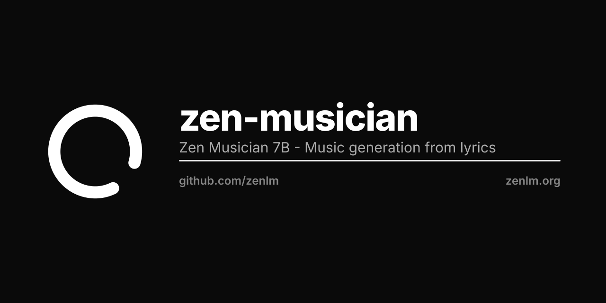

<p align="center"></p>

# Zen Musician

**Zen Musician** is a music generation foundation model that transforms lyrics into full songs with both vocal and accompaniment tracks, supporting diverse genres, languages, and vocal techniques.

## About

Zen Musician uses a two-stage transformer architecture enhanced through LoRA finetuning to expand its capabilities across multiple genres and musical styles. The model can generate complete songs lasting several minutes, with support for:

- Multiple languages (English, Chinese, Japanese, Korean, Cantonese)
- Diverse musical genres
- Advanced vocal techniques
- In-context learning (ICL) for style transfer
- Music continuation and incremental generation

## HuggingFace Models

- **[zenlm/zen-musician-7b](https://huggingface.co/zenlm/zen-musician-7b)**: Zen Musician 7B
- **zenlm/zen-musician-lora-***: Genre-specific LoRA adapters (Coming soon)

## Hardware Requirements

### GPU Memory
- **24GB or less**: Run up to 2 sessions
- **80GB+ (H800, A100, RTX4090 multi-GPU)**: Full song generation with 4+ sessions

### Execution Time
- **H800 GPU**: ~150s for 30s audio
- **RTX 4090**: ~360s for 30s audio

## Installation

### 1. Setup Environment

```bash
# Create conda environment
conda create -n zen-musician python=3.8
conda activate zen-musician

# Install CUDA 11.8+
conda install pytorch torchvision torchaudio cudatoolkit=11.8 -c pytorch -c nvidia

# Install dependencies
pip install -r requirements.txt

# Install Flash Attention 2 (mandatory for memory efficiency)
pip install flash-attn --no-build-isolation
```

### 2. Download Code and Tokenizer

```bash
# Install git-lfs
sudo apt update && sudo apt install git-lfs
git lfs install

# Clone repository
git clone https://github.com/zenlm/zen-musician.git
cd zen-musician/inference/

# Download tokenizer
git clone https://huggingface.co/zenlm/zen-musician-codec
```

## Usage

### Basic Generation (CoT Mode)

```bash
cd inference/
python infer.py \
    --cuda_idx 0 \
    --stage1_model zenlm/zen-musician-s1-7b \
    --stage2_model zenlm/zen-musician-s2-1b \
    --genre_txt ../prompt_egs/genre.txt \
    --lyrics_txt ../prompt_egs/lyrics.txt \
    --run_n_segments 2 \
    --stage2_batch_size 4 \
    --output_dir ../output \
    --max_new_tokens 3000 \
    --repetition_penalty 1.1
```

### Dual-Track ICL Mode (Style Transfer)

```bash
cd inference/
python infer.py \
    --cuda_idx 0 \
    --stage1_model zenlm/zen-musician-s1-7b-icl \
    --stage2_model zenlm/zen-musician-s2-1b \
    --genre_txt ../prompt_egs/genre.txt \
    --lyrics_txt ../prompt_egs/lyrics.txt \
    --run_n_segments 2 \
    --stage2_batch_size 4 \
    --output_dir ../output \
    --max_new_tokens 3000 \
    --repetition_penalty 1.1 \
    --use_dual_tracks_prompt \
    --vocal_track_prompt_path ../prompt_egs/pop.00001.Vocals.mp3 \
    --instrumental_track_prompt_path ../prompt_egs/pop.00001.Instrumental.mp3 \
    --prompt_start_time 0 \
    --prompt_end_time 30
```

### Single-Track ICL Mode

```bash
cd inference/
python infer.py \
    --cuda_idx 0 \
    --stage1_model zenlm/zen-musician-s1-7b-icl \
    --stage2_model zenlm/zen-musician-s2-1b \
    --genre_txt ../prompt_egs/genre.txt \
    --lyrics_txt ../prompt_egs/lyrics.txt \
    --run_n_segments 2 \
    --stage2_batch_size 4 \
    --output_dir ../output \
    --max_new_tokens 3000 \
    --repetition_penalty 1.1 \
    --use_audio_prompt \
    --audio_prompt_path ../prompt_egs/pop.00001.mp3 \
    --prompt_start_time 0 \
    --prompt_end_time 30
```

## LoRA Finetuning

Zen Musician supports LoRA (Low-Rank Adaptation) finetuning for genre expansion and style adaptation. See [finetune/README.md](finetune/README.md) for detailed instructions.

### Quick Start

```bash
cd finetune/
# Follow instructions in finetune/README.md
```

## Prompt Engineering

### Genre Tags
- Use space-separated tags: `genre instrument mood gender timbre`
- Example: `"inspiring female uplifting pop airy vocal electronic bright vocal"`
- See [top_200_tags.json](top_200_tags.json) for recommended tags
- Use "Mandarin" or "Cantonese" tags for Chinese languages

### Lyrics
- Structure with labels: `[verse]`, `[chorus]`, `[bridge]`, `[outro]`
- Separate sessions with double newlines `\n\n`
- Keep each session around 30s (avoid too many words)
- Start with `[verse]` or `[chorus]` (avoid `[intro]`)
- See [prompt_egs/lyrics.txt](prompt_egs/lyrics.txt) for examples

### Audio Prompts (ICL)
- Optional but improves quality
- Dual-track ICL (vocal + instrumental) works best
- Use ~30s chorus sections for best results
- Extract tracks with [python-audio-separator](https://github.com/nomadkaraoke/python-audio-separator)

## Windows Users

- **One-click installer**: [Pinokio](https://pinokio.computer)
- **Docker/Gradio**: One-click installer via [Pinokio](https://pinokio.computer)

## Roadmap

- [ ] Release zen-musician base model
- [ ] Release genre-specific LoRA adapters
- [ ] Support llama.cpp/GGUF quantization
- [ ] HuggingFace Space demo
- [ ] vLLM/sglang inference support
- [ ] Stem generation mode
- [ ] Additional genre training

## License

Zen Musician is released under the **Apache License 2.0**.

- We encourage commercial use while maintaining proper attribution
- Label AI-generated content as "AI-generated" or "AI-assisted"

## Links

- **GitHub**: https://github.com/zenlm/zen-musician
- **HuggingFace**: https://huggingface.co/zenlm/zen-musician-7b
- **Organization**: https://github.com/zenlm
- **Zen Gym** (Training): https://github.com/zenlm/zen-gym
- **Zen Engine** (Inference): https://github.com/zenlm/zen-engine

---

**Zen Musician** - Transforming lyrics into music with AI
